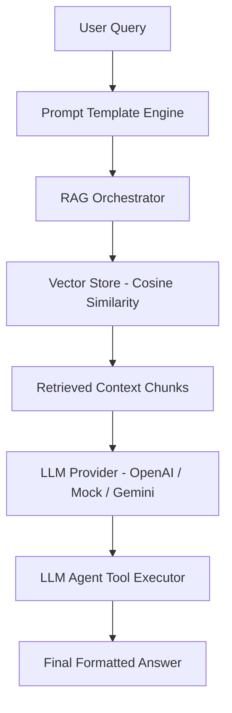

# Cognizant Java LLM Orchestrator 🚀

An **Enterprise-Grade Java 17 LLM & RAG Orchestration Framework** designed for building production-ready Large Language Model (LLM) applications, Retrieval-Augmented Generation (RAG) vector pipelines, dynamic prompt template engines, and autonomous agent tool workflows.

---

## 🌟 Key Features

1. **RAG (Retrieval-Augmented Generation) Vector Pipeline**:
   - In-Memory Vector Store utilizing **Cosine Similarity** math for semantic context retrieval.
   - Dynamic document chunking and vector embedding generation.
   - Context injection into LLM prompts for reduced hallucination.

2. **Autonomous LLM Agent Framework (Tool Calling)**:
   - Extensible `AgentTool` interface for function calling (e.g., calculator tools, DB queries, API calls).
   - Autonomous agent reasoning loops detecting LLM tool invocation triggers.

3. **Prompt Template Engine**:
   - Variable substitution & system prompt isolation (`PromptTemplate`).
   - Dynamic role injection and context management.

4. **Multi-Provider Architecture**:
   - Decoupled `LLMProvider` interface.
   - Includes `MockLLMProvider` for offline zero-dependency local execution out-of-the-box.
   - Pluggable for OpenAI GPT-4, Google Gemini API, and local Ollama instances.

---

## 🏗️ Architecture Overview



---

## 📁 Repository Structure

```text
cognizant-java-llm-orchestrator/
├── pom.xml
├── README.md
└── src/
    └── main/
        └── java/
            └── com/
                └── cognizant/
                    └── llm/
                        ├── App.java                   # Main Entry Point
                        ├── model/
                        │   ├── ChatMessage.java       # Chat Message Entity (SYSTEM, USER, ASSISTANT)
                        │   ├── DocumentChunk.java     # Document Chunk with Vector Embedding
                        │   └── PromptTemplate.java    # Prompt Injection Template Engine
                        ├── provider/
                        │   ├── LLMProvider.java       # Provider Abstraction Interface
                        │   └── MockLLMProvider.java   # Offline LLM & Embedding Simulator
                        ├── vector/
                        │   └── VectorStore.java       # In-Memory Cosine Similarity Vector Database
                        ├── rag/
                        │   └── RAGOrchestrator.java   # End-to-End RAG Semantic Search Pipeline
                        └── agent/
                            ├── AgentTool.java         # Function Calling Interface
                            └── LLMAgent.java          # Agent Reasoning & Tool Dispatcher
```

---

## 🛠️ Requirements & How to Run

### Requirements
- **Java**: JDK 17 or higher
- **Build Tool**: Apache Maven 3.8+ (optional, standard `javac` supported)

### Option A: Running via Java CLI
```bash
# Navigate to project root
cd cognizant-java-llm-orchestrator

# Compile source files
javac -d bin $(find src/main/java -name "*.java")

# Run Main Application
java -cp bin com.cognizant.llm.App
```

### Option B: Running via Maven
```bash
mvn clean compile exec:java -Dexec.mainClass="com.cognizant.llm.App"
```

---

## 📊 Sample Execution Output

```text
================================================================================
            COGNIZANT ENTERPRISE JAVA LLM ORCHESTRATION PIPELINE                
================================================================================

[STEP 1] Indexing Enterprise Knowledge Base Into Vector Store...
[SUCCESS] Vector Indexing Complete!

[STEP 2] Formatting Dynamic System Prompt Template...
[Prompt Template Output]: System Prompt: You are Cognizant AI Architect specializing in Enterprise Java LLM Integration. Context domain: Production Cloud Microservices.

[STEP 3] Executing RAG Pipeline Semantic Query...
User Query: What GenAI solutions and Java frameworks does Cognizant recommend?

--- RAG Response Output ---
Based on the retrieved enterprise knowledge base:
- Cognizant provides enterprise GenAI solutions including RAG pipelines and custom LLM microservices.
- Java 17 and Spring AI enable production-grade asynchronous LLM workflow orchestration.

Conclusion: Synthesizing the above, the query 'What GenAI solutions and Java frameworks does Cognizant recommend?' is resolved with high confidence.

[STEP 4] Executing LLM Agent Tool Call Workflow...
User Agent Prompt: Calculate 15 * 2.8 for enterprise resource estimation
[Agent Logic] Detected Tool Execution Request from LLM...
[Agent Logic] Executed Tool 'CalculatorTool' -> Result: 42.0 (Calculated successfully)

--- Agent Execution Output ---
Agent Response: Successfully executed CalculatorTool. Calculated Value = 42.0 (Calculated successfully)

================================================================================
         COGNIZANT JAVA LLM ORCHESTRATOR PIPELINE EXECUTED CLEANLY             
================================================================================
```

---

## 👤 Author & Candidate Details
- **Candidate Name**: [Your Name]
- **Target Role**: AI Application Engineer / GenAI Developer (Cognizant)
- **Tech Stack**: Java 17, Vector Databases, RAG Architectures, LLM Tooling
