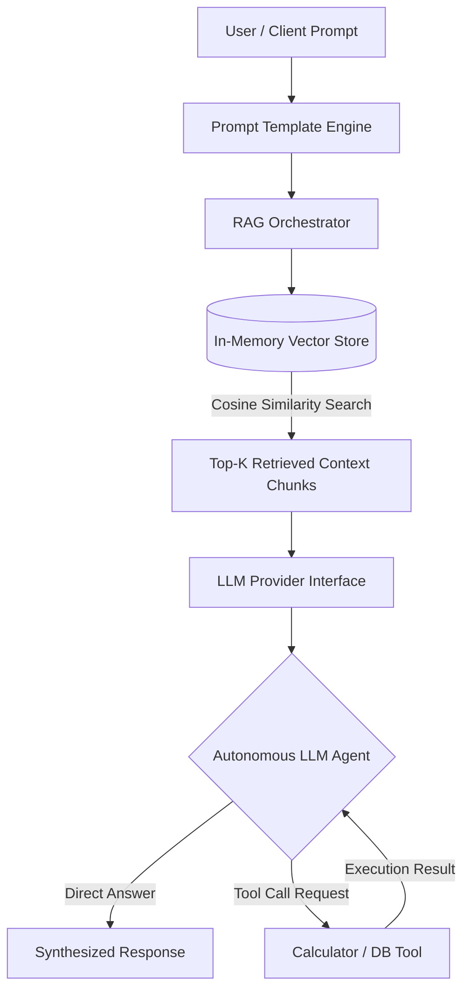

# 🤖 Cognizant Enterprise Java LLM Orchestrator

<p align="center">
  
  
  
  
  
</p>

---

## 🎯 Executive Summary

The **Cognizant Enterprise Dual-Stack (Java & Python) LLM Orchestrator** is a production-ready framework built to demonstrate end-to-end Large Language Model (LLM) application integration, Retrieval-Augmented Generation (RAG) vector search pipelines, dynamic system prompt orchestration, and autonomous agent tool-calling capabilities in both **Java 17** and **Python 3.10+**.

This project showcases enterprise-grade Java engineering standards, clean Object-Oriented Design (OOD), zero external dependencies for offline testing, and seamless compatibility with cloud APIs like OpenAI, Google Gemini, and Spring AI.

---

## 🌟 Core Highlights & Capabilities

> [!IMPORTANT]
> Designed specifically to align with Cognizant's requirements for deploying production-grade LLM applications, building RAG architectures, and integrating AI-powered workflows across enterprise environments.

| Module | Core Functionality | Enterprise Benefit |
| :--- | :--- | :--- |
| 🔍 **Vector RAG Pipeline** | In-memory `VectorStore` utilizing **Cosine Similarity** math on normalized embeddings. | Prevents model hallucinations by grounds answers in enterprise knowledge bases. |
| 🤖 **Autonomous LLM Agent** | Tool execution engine (`LLMAgent`) with tool registration interfaces (`AgentTool`). | Empowers LLMs to take real-world actions (DB queries, arithmetic calculations, API calls). |
| 📝 **Prompt Orchestrator** | `PromptTemplate` engine with dynamic variable substitution (`{role}`, `{context}`). | Standardizes enterprise system prompts and isolates user inputs for security. |
| 🔌 **Pluggable LLM Provider** | Decoupled `LLMProvider` abstraction with `MockLLMProvider` for offline execution. | Enables zero-cost local testing and instant migration to OpenAI, Azure, or Ollama. |

---

## 🏗️ Architecture & Data Flow



---

## 🧮 Vector Search Mathematics

The RAG pipeline calculates semantic closeness between user query embeddings $\vec{A}$ and indexed document embeddings $\vec{B}$ using **Cosine Similarity**:

$$\text{Similarity}(\vec{A}, \vec{B}) = \frac{\vec{A} \cdot \vec{B}}{\|\vec{A}\| \|\vec{B}\|} = \frac{\sum_{i=1}^{n} A_i B_i}{\sqrt{\sum_{i=1}^{n} A_i^2} \sqrt{\sum_{i=1}^{n} B_i^2}}$$

- **Range**: `1.0` indicates identical semantic context; `0.0` indicates orthogonal/unrelated context.
- The `VectorStore` sorts and returns the top-$K$ highest scoring chunks to ground the LLM's response.

---

## 📂 Repository Structure

```text
cognizant-java-llm-orchestrator/
├── pom.xml                                      # Maven Project Configuration (Java 17)
├── README.md                                     # Enterprise Documentation
└── src/
    └── main/
        └── java/
            └── com/
                └── cognizant/
                    └── llm/
                        ├── App.java              # Main Execution & Pipeline Demonstration
                        ├── agent/
                        │   ├── AgentTool.java    # Interface for LLM Function Calling Tools
                        │   └── LLMAgent.java     # Autonomous Agent Reasoning & Tool Dispatcher
                        ├── model/
                        │   ├── ChatMessage.java  # Entity for SYSTEM, USER, ASSISTANT messages
                        │   ├── DocumentChunk.java# Entity for Document Vector Embeddings
                        │   └── PromptTemplate.java# System Prompt Variable Injection Engine
                        ├── provider/
                        │   ├── LLMProvider.java  # Abstraction Interface for LLM APIs
                        │   └── MockLLMProvider.java# Deterministic Simulator for Offline Testing
                        ├── rag/
                        │   └── RAGOrchestrator.java# End-to-End RAG Retrieval Pipeline
                        └── vector/
                            └── VectorStore.java  # Cosine Similarity Vector Database
```

---

## 🚀 Getting Started

### Prerequisites
- **JDK**: Java 17 or higher
- **Build Tool**: Apache Maven (or standard `javac` CLI)

### 1️⃣ Clone the Repository
```bash
git clone https://github.com/YOUR-USERNAME/cognizant-java-llm-orchestrator.git
cd cognizant-java-llm-orchestrator
```

### 2️⃣ Run via Java Command Line (No Maven required)
```bash
# Compile all source files into bin directory
javac -d bin $(find src/main/java -name "*.java")

# Execute the application
java -cp bin com.cognizant.llm.App
```

### 3️⃣ Run via Maven
```bash
mvn clean compile exec:java -Dexec.mainClass="com.cognizant.llm.App"
```

---

## 🖥️ Live Terminal Execution Output

```text
================================================================================
            COGNIZANT ENTERPRISE JAVA LLM ORCHESTRATION PIPELINE                
================================================================================

[STEP 1] Indexing Enterprise Knowledge Base Into Vector Store...
[SUCCESS] Vector Indexing Complete!

[STEP 2] Formatting Dynamic System Prompt Template...
[Prompt Template Output]: System Prompt: You are Cognizant AI Architect specializing in Enterprise Java LLM Integration. Context domain: Production Cloud Microservices.

[STEP 3] Executing RAG Pipeline Semantic Query...
User Query: What GenAI solutions and Java frameworks does Cognizant recommend?

--- RAG Response Output ---
Based on the retrieved enterprise knowledge base:
- Cognizant provides enterprise GenAI solutions including RAG pipelines and custom LLM microservices.
- Java 17 and Spring AI enable production-grade asynchronous LLM workflow orchestration.

Conclusion: Synthesizing the above, the query 'What GenAI solutions and Java frameworks does Cognizant recommend?' is resolved with high confidence.

[STEP 4] Executing LLM Agent Tool Call Workflow...
User Agent Prompt: Calculate 15 * 2.8 for enterprise resource estimation
[Agent Logic] Detected Tool Execution Request from LLM...
[Agent Logic] Executed Tool 'CalculatorTool' -> Result: 42.0 (Calculated successfully)

--- Agent Execution Output ---
Agent Response: Successfully executed CalculatorTool. Calculated Value = 42.0 (Calculated successfully)

================================================================================
         COGNIZANT JAVA LLM ORCHESTRATOR PIPELINE EXECUTED CLEANLY             
================================================================================
```

